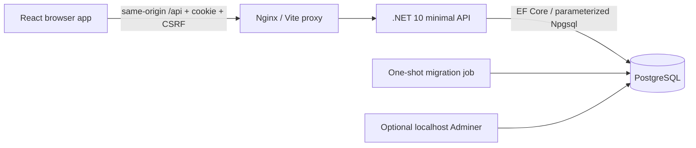

# Architecture

`Frontend/src/App.tsx` coordinates authenticated state and lazy page loading. `services/http.ts` provides same-origin fetch with abort support, a 15-second timeout, cookie credentials, CSRF headers, multipart uploads, and safe API errors. `services/api.ts` validates responses with Zod and coordinates CSRF acquisition. `services/storage.ts` contains public TypeScript contracts and the optional language preference only: accounts and session tokens are never kept in localStorage. `services/forum.ts` calls the API; it no longer simulates authorization or persistence.

`Backend/Program.cs` configures authentication, authorization, CSRF, rate limiting, trusted forwarded headers, uniform exceptions, readiness, and endpoint groups. Endpoint modules cover auth, gym management, announcements, forum/categories/images. `Security/Rules.cs` holds validation, rich-text sanitation, booking time rules, and optimistic-version checks. `GymDb` uses scoped EF Core contexts, PostgreSQL indexes and constraints, and versioned migrations.

## Data model

- Members: normalized unique email, server-controlled role and verification, PBKDF2 password hash, profile fields.
- Sessions: SHA-256 hashes of random 256-bit cookie tokens, owner foreign key and eight-hour expiry.
- Settings: one constrained singleton row; default daily capacity is 12.
- Bookings: member/date unique constraint, calendar-date index, duration/grid SQL constraint, cancellation flag.
- Announcements and news comments: relational authors and post foreign keys; drafts visible only to administrators.
- Categories, discussions and forum replies: relational authors, category foreign key and pinned chronology indexes.
- Uploads: normalized JPEG bytes in PostgreSQL; foreign keys to the owning discussion or reply. Unattached uploads are private and cleaned after 24 hours.
- Audit: actor ID, action, target ID and UTC timestamp. Content, credentials, cookies and personal details are not recorded in events.

`version` is PostgreSQL's `xmin`, represented as a JSON number. Profiles, settings, bookings, announcements, discussion updates, pins and category updates require the version returned by the API. EF Core also checks the version at write time. A competing edit returns `409 CONFLICT_REFRESH` rather than overwriting silently. Destructive operations are explicit and confirmed by the UI; category deletion checks a version and performs reassignment in one transaction.

## Booking concurrency

Times are minute offsets; calendar dates use PostgreSQL `date`. Current-week checks use Europe/Warsaw on the server. A booking write takes a shared lock on settings and a transaction-scoped PostgreSQL advisory lock keyed by calendar day. All API replicas using the database therefore serialize the final capacity check and insert/update for that day. The distinct-person count ignores cancelled bookings and excludes the booking owner. The unique member/date index prevents duplicate daily sessions. Updates preserve the original booking date; create requests cannot assign an arbitrary member ID. Administrators edit an existing booking to manage another member's session.

## Reads and scaling

Lists use pages of 50 plus one lookahead row; comments are loaded independently in pages of 50. Forum title/category filters run in PostgreSQL. Booking reads require a range of at most 92 days and return at most 10,000 rows. Drafts and private member profiles do not enter ordinary-member responses. Images are served only through authorized endpoints, and feed lists never include image bytes. Read queries use no tracking where updates are unnecessary. Each request has a scoped context and cancellation token; independent frontend loads run concurrently.

Offset pagination is appropriate for this gym-sized application, but inserts can shift page boundaries. Move large deployments to cursor pagination and indexed full-text search after measuring workload. User and announcement management search currently filters the loaded page; page controls access the remaining records. Rate-limit state and image-decode concurrency gates are per API instance. Add an edge/distributed limiter if horizontally scaling.

## Persistence and upgrades

The migration job has owner credentials; the runtime API uses `liftapp`, with DML permissions and no schema-owner privileges. Bootstrap only creates a first administrator and default settings/categories; there are no mock accounts. The runtime does not migrate automatically. PostgreSQL volumes persist the complete application data, including images. A separate volume persists Data Protection keys for CSRF cookies. Production secret files stay outside source control.
